# Proof (Screenshots)

This repo does not keep AWS resources running continuously (cost control). The screenshots below prove the AWS deployment and CI/CD rollout were executed successfully.

## 1) Security boundary (not public)

### ALB Security Group: inbound 80/443 (internet-facing)
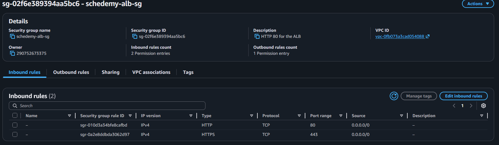

### App Security Group: inbound 8080 only from the ALB Security Group
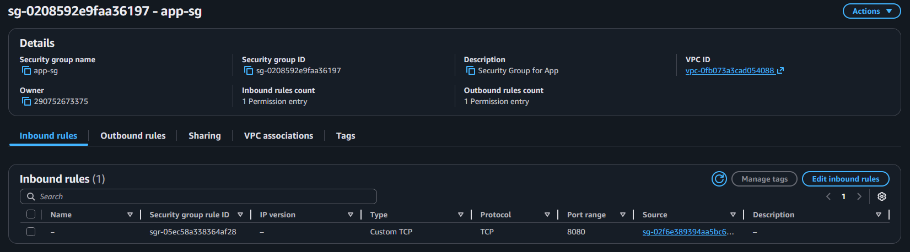

## 2) Artifact-based deployments

### S3 artifact location (releases/app.jar)
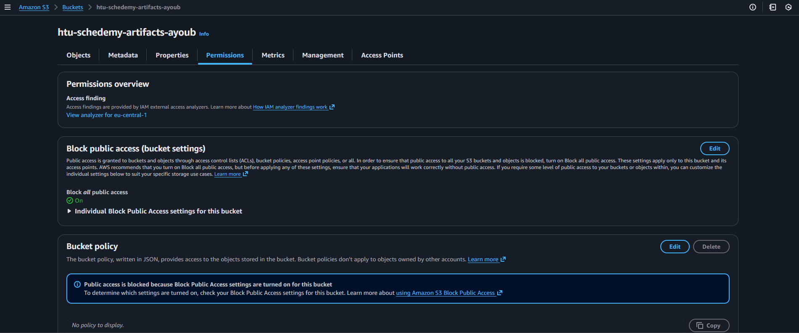

### EC2 instance role / instance profile (read access to artifact bucket)
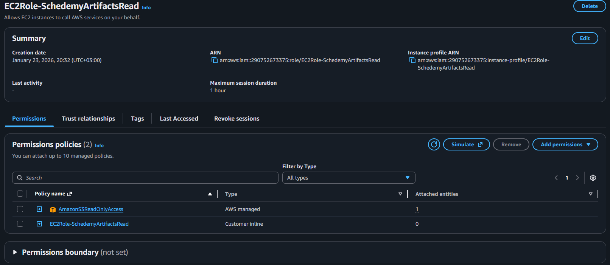

## 3) Compute + scaling

### Launch Template used by ASG
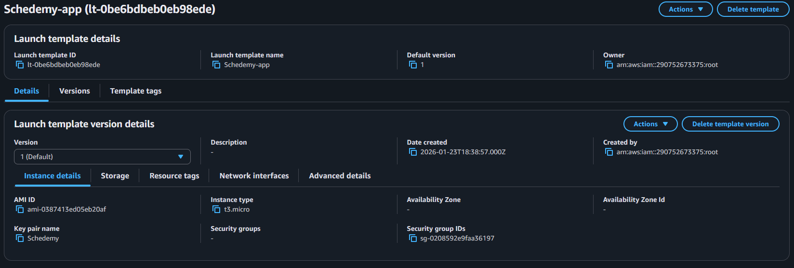

### Launch Template user-data bootstrap (install Java, download artifact, systemd)
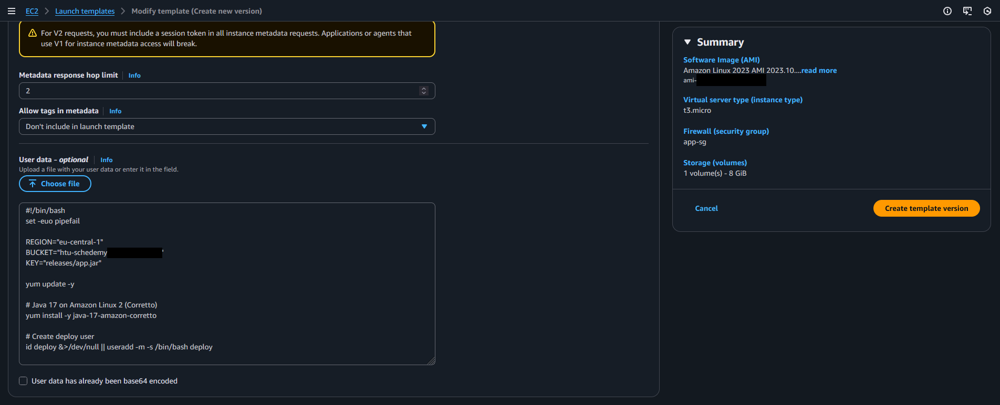

### Auto Scaling Group configuration (capacity / instance management)
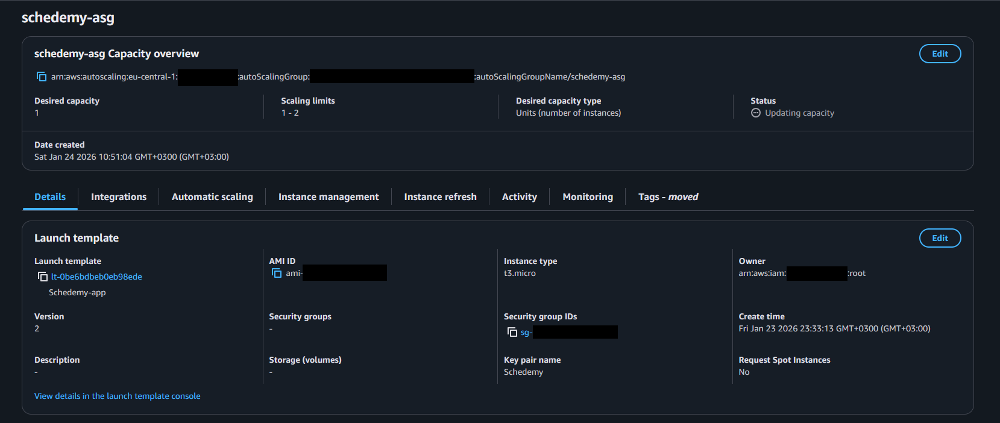

## 4) Load balancing + health checks

### Target Group configuration + health check path
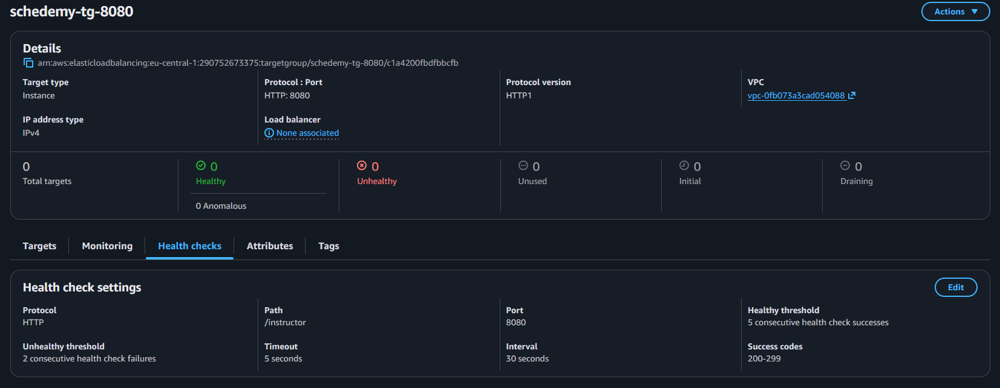

### ALB listener forwarding to the Target Group
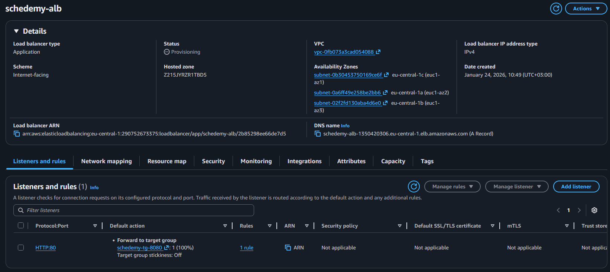

### Registered targets healthy
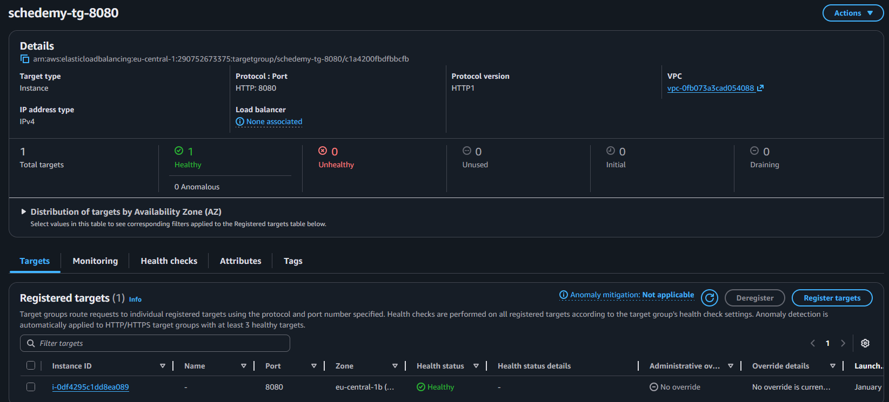

## 5) CI/CD (GitHub Actions + OIDC) + safe rollout

### OIDC provider (no long-lived AWS keys in GitHub)
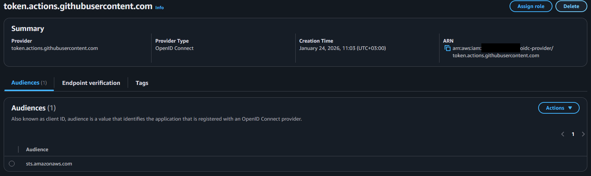

### Least-privilege policy for the workflow (S3 upload + ASG refresh)
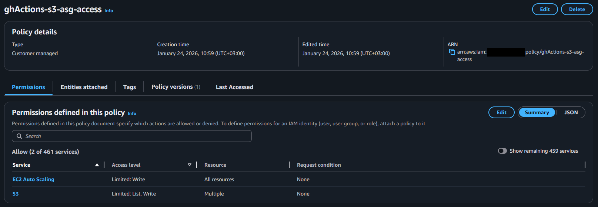

### Workflow file stored in the repo
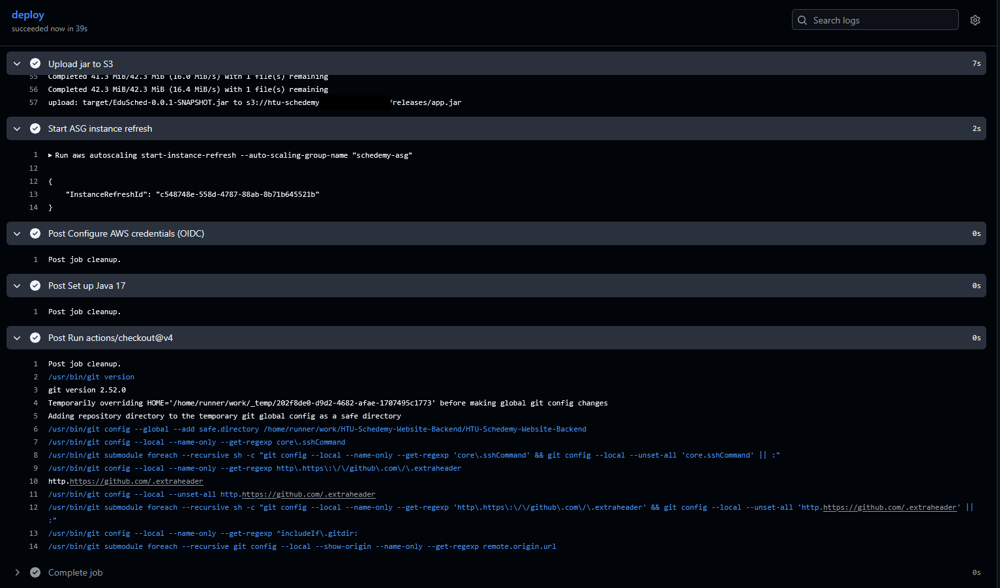

### GitHub Actions run showing upload + refresh trigger
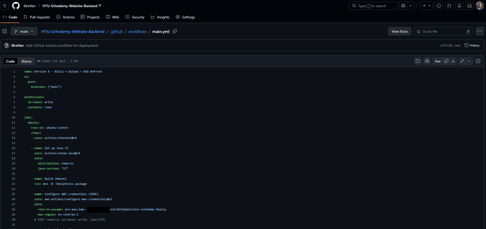

### S3 updated after GitHub Actions upload
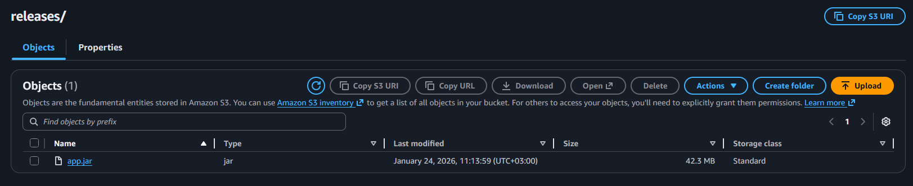

### ASG Instance Refresh in progress
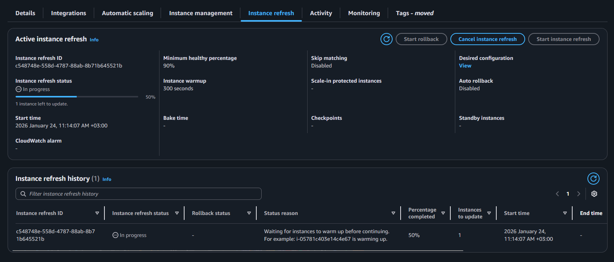

### Target Group healthy after refresh
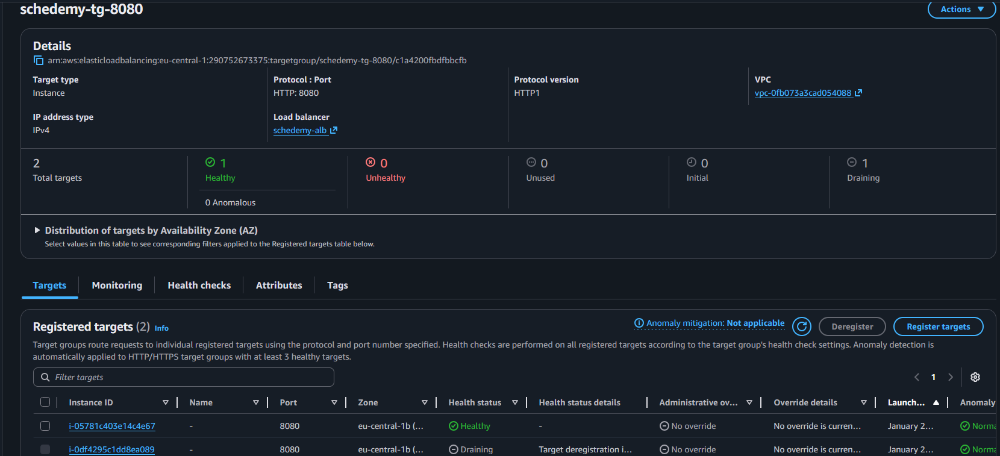

## 6) Functional validation

### API response via ALB endpoint
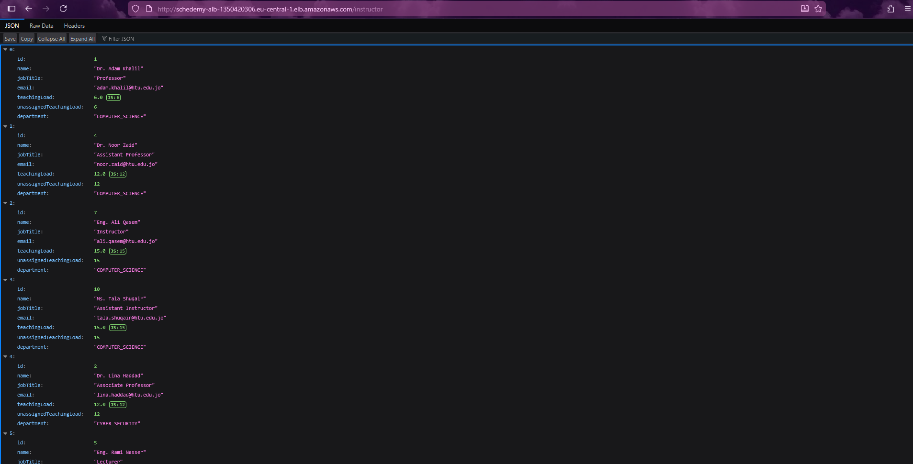
